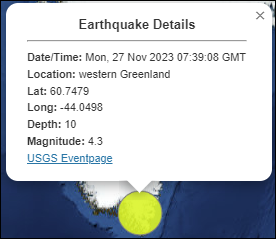
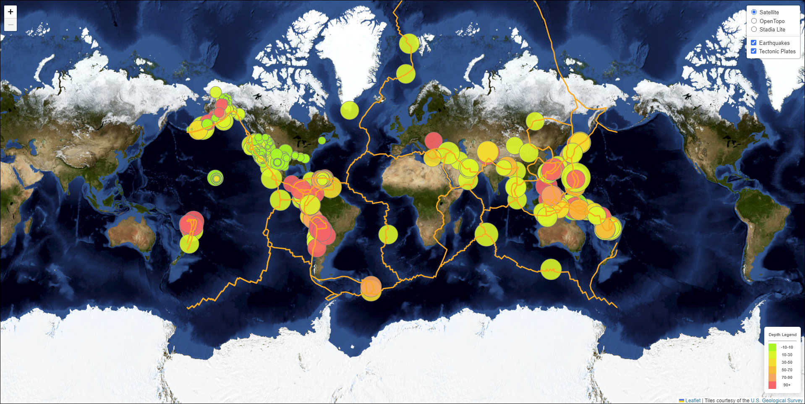

# leaflet-challenge

### Scenario

The United States Geological Survey, or USGS for short, is responsible for providing scientific data about natural hazards, the health of our ecosystems and environment, and the impacts of climate and land-use change. Their scientists develop new methods and tools to supply timely, relevant, and useful information about the Earth and its processes.

The USGS is interested in building a new set of tools that will allow them to visualize their earthquake data. They collect a massive amount of data from all over the world each day, but they lack a meaningful way of displaying it. In this challenge, you have been tasked with developing a way to visualize USGS data that will allow them to better educate the public and other government organizations (and hopefully secure more funding) on issues facing our planet.

Using one of the GeoJSON API endpoints from [USGS](http://earthquake.usgs.gov/earthquakes/feed/v1.0/geojson.php):

- Visualize the global earthquakes on a Leaflet map
- Build upon the map by introducing additional data

------

### Leaflet Map

Required steps:

- Get your dataset.
    - I chose to use the `Past 7 Days` dataset which can be found [here](https://earthquake.usgs.gov/earthquakes/feed/v1.0/summary/all_week.geojson)
- Import and visualize the data by doing the following:
    - Using Leaflet, create a map that plots all the earthquakes from your dataset based on their longitude and latitude.
        - Your data markers should reflect the magnitude of the earthquake by their size and the depth of the earthquake by color. Earthquakes with higher magnitudes should appear larger, and earthquakes with greater depth should appear darker in color.
    - Include popups that provide additional information about the earthquake when its associated marker is clicked.
    - Create a legend that will provide context for your map data.

 

| Marker Popup Example |
|----------|
|  |

------

### Gather and Plot More Data

- Plot a second dataset on your map to illustrate the relationship between tectonic plates and seismic activity. You will need to pull in this dataset and visualize it alongside your original data.
- Perform the following tasks:
    - Plot the tectonic plates dataset on the map in addition to the earthquakes.
    - Add other base maps to choose from.
    - Put each dataset into separate overlays that can be turned on and off independently.
    - Add layer controls to your map.

 

| Completed Visualization |
|----------|
|  |

<i>Note: Due to CORS, the tectonic plates do not load within the GitHub Pages representation. Please follow the below steps to view</i>

 

### Steps to View Full Map Visualization

- Clone this repo
- Navigate to the directory using the terminal
- Within the terminal run the following command:
    - `python -m http.server`
- Open a browser window and navigate to: `127.0.0.1:8000`
- The full map should display correctly here

--------

## References

| Reference Name | Description |
|----------------|-------------|
| CSS Styling for the `Legend` | CSS styling was adapted from Module 15, Class 3, Activity 02-Citi Bike Leaflet (Solved) File |
| [D3 Library](https://d3js.org/) | D3 by Observable. Used to build visuals and manipulate HTML/CSS elements |
| edX Boot Camps LLC | Putting the assignment together and supplying of the starter files |
| [fraxen/tectonicplates](https://github.com/fraxen/tectonicplates) | GitHub Repo containing json files for the boundaries of Earth's Tectonic Plates |
| [Leaflet](https://leafletjs.com/) | Leaflet is the leading open-source JavaScript library for mobile-friendly interactive maps. |
| [Plotly Library](https://plotly.com/javascript/) | JavaScript library which enables the creation of Interactive Visuals with low code |
| [United States Geological Survey](http://earthquake.usgs.gov/earthquakes/feed/v1.0/geojson.php) | Provided the API endpoints required for the dataset retrieval |